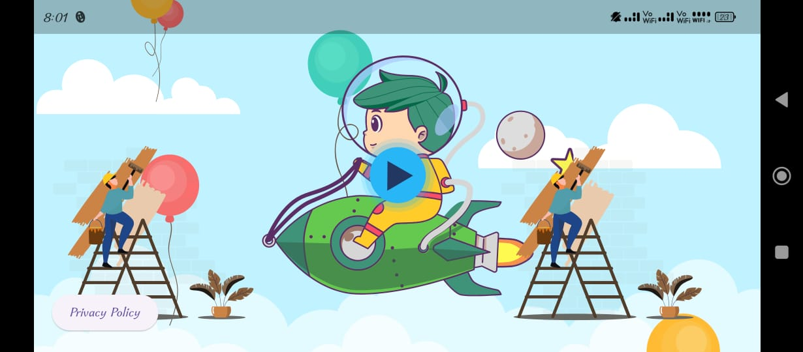
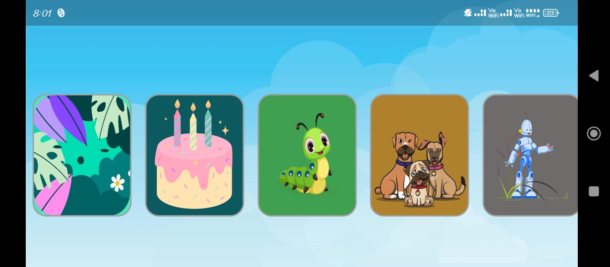
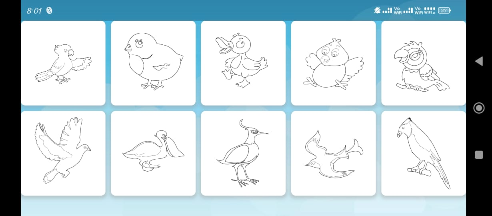
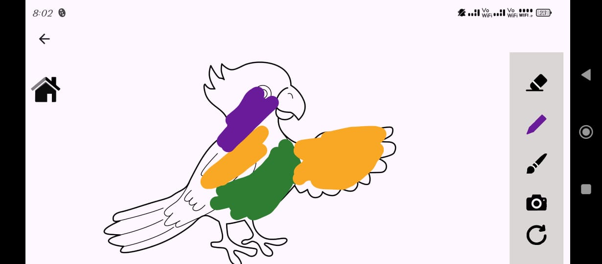

# 🎨 Flutter Drawing App for Kids

A fun and engaging drawing app designed especially for children!  
It features an attractive animated UI, category-based drawing books, and a creative canvas where kids can color freely.

---

## ✨ Features

- 🏠 **Animated Home Page**  
  Eye-catching animations greet kids when they launch the app.

- 📚 **Drawing Books by Category**  
  Kids can choose from various themes like animals, cartoons, fruits, and more.

- 🎨 **Coloring Tools**  
  - Multiple brush colors  
  - Adjustable marker width  
  - Eraser functionality

- 🔍 **Zoom In / Zoom Out**  
  Pinch or tap controls to zoom the canvas.

- 📸 **Screenshot Tool**  
  Save the final artwork to the device gallery.

- 🔊 **Fun Sound Effects**  
  Sound plays during interactions for a joyful experience.

---

## 🚀 Getting Started
## 🖼️ Screenshots

### 🏠 Dashboard (Home Page)


### 📚 Drawing Books Selection


### 🖌️ Drawing Pages


### 🎨 Drawing Canvas



### Prerequisites:
- Flutter SDK
- Android Studio or VS Code
- Emulator or real device

### Run it locally:
```bash
flutter pub get
flutter run

